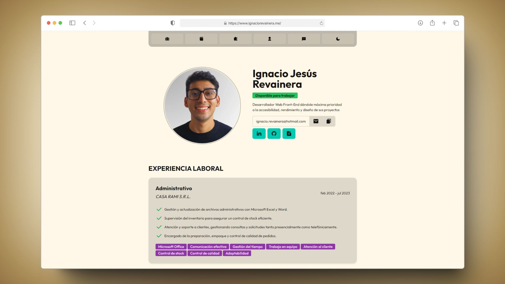
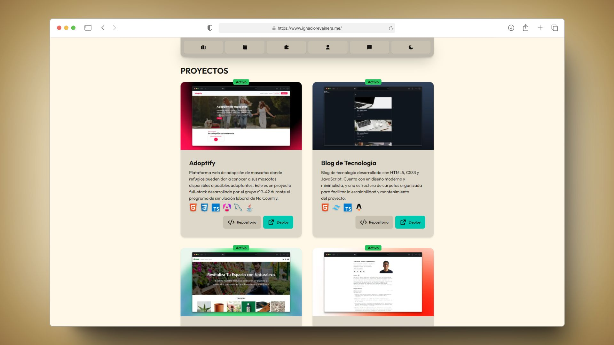
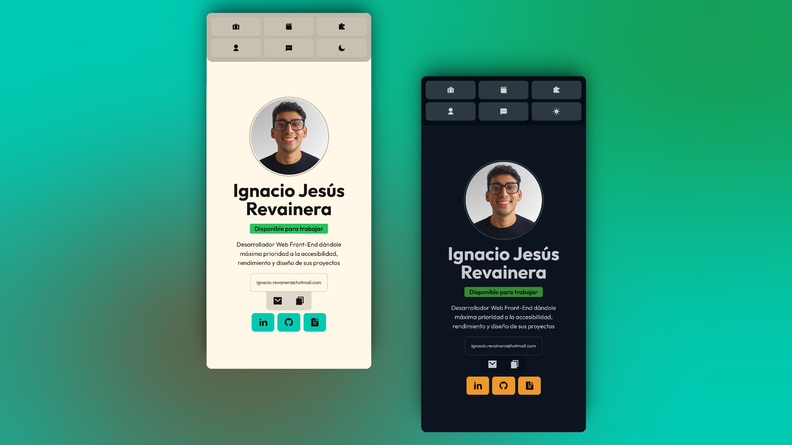

# 📄 Mi Portfolio

Aquí encontrarás una colección de mis proyectos más destacados, experimentos y todo lo relacionado con mi viaje como desarrollador frontend. Me apasiona diseñar y codificar experiencias de usuario que no solo sean visualmente atractivas, sino también funcionales y optimizadas.

## ✨ Características

-   **Diseño Moderno**: Utilizo DaisyUI para darle a mi portfolio un toque moderno y atractivo, asegurando que la experiencia de usuario sea siempre del más alto nivel.
-   **Optimizado con Astro**: Para garantizar tiempos de carga rápidos y una excelente performance, mi sitio está optimizado con Astro, permitiendo una entrega eficiente del contenido estático.
-   **Modo Oscuro y Modo Claro**: Con la implementación de un switch para el modo oscuro y claro, ofrezco a los visitantes la capacidad de personalizar su experiencia de navegación según sus preferencias o condiciones de iluminación.
-   **Responsive Design**: Mi portfolio está completamente optimizado para tablets y smartphones, asegurando una experiencia de usuario fluida y accesible, sin importar el dispositivo.

## 💻 Tecnologías

-   **HTML**: La estructura de cada página está cuidadosamente construida con HTML5, siguiendo las mejores prácticas para asegurar accesibilidad y compatibilidad.
-   **CSS & Tailwind CSS**: Para agilizar el desarrollo y garantizar un diseño coherente, utilizo Tailwind CSS, un framework de CSS utility-first que me permite personalizar rápidamente el diseño sin alejarme de la consistencia.
-   **TypeScript**: Esto le da vida a la página, permitiéndome implementar funcionalidades interactivas y dinámicas que mejoran la experiencia del usuario.
-   **Astro**: Como motor de mi portfolio, Astro me permite integrar estas tecnologías de manera eficiente, asegurando una experiencia de usuario rápida y sin complicaciones.

## 📬 Contacto

Si tienes alguna pregunta, o simplemente quieres saludar, no dudes en contactarme. ¡Siempre estoy buscando colaborar en proyectos interesantes!

-   Envíame un email a: [ignacio.revainera@hotmail.com](mailto:ignacio.revainera@hotmail.com)
-   Conéctate conmigo en [LinkedIn](https://www.linkedin.com/in/ignaciorevainera/)

---

¡Gracias por visitar mi portfolio! Espero que disfrutes explorando mi trabajo tanto como yo disfruté creándolo. 🚀🎨
